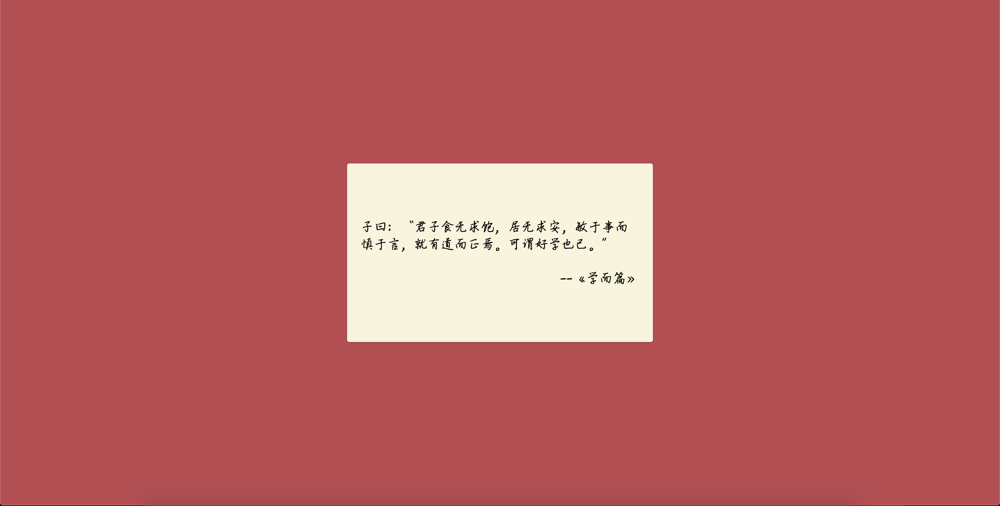

## Poetry Tab


### 简介

简单的tab页插件，页面随机显示论语，点击语句可以切换。
后面将加入其他内容。


### 截图




### 使用

* [下载插件包](https://github.com/Kuari/poetry-tab/releases/download/v1.1.0/poetry_tab.zip)

* chrome打开开发者模式，添加解压后的文件夹


### 源码安装

* 拉下仓库

```bash
git clone https://github.com/Kuari/poetry-tab.git
cd poetry-tab
```

* 编译

```node.js
yarn
yarn build
```

* 创建拓展内容

```bash
mkdir ext
cp -rf dit manifest.json ext
```

* chrome添加插件，选择目标路径

```bash
<your-path>/poetry-tab/ext
```


